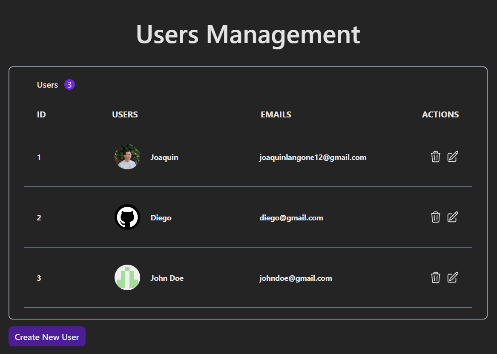
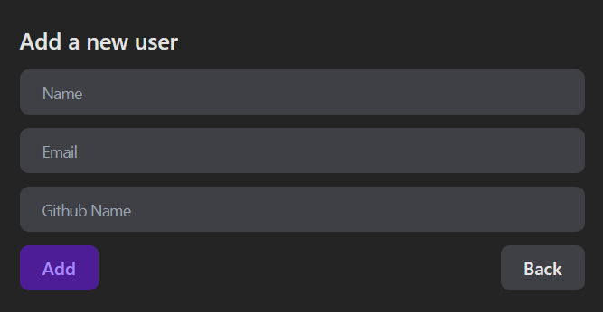

# User Management

User Management is a simple CRUD application built with React.js, Redux Toolkit, Tailwind CSS, and TypeScript. It provides basic functionality to manage a list of users, allowing users to be created, edited, and deleted. Instead of using a traditional database, the application utilizes local storage to store user data.

## Features

- Create new users with specified details.
- View a list of all users in a table format.
- Edit existing user information.
- Delete users from the list.

## Technologies Used

- **Vite:** 
- **React:**
- **TypeScript:**
- **Redux Toolkit:**
- **Tailwind CSS:**
  
## Getting Started

To run this project locally, follow these steps:

1. Clone this repository to your local machine.
2. Navigate to the project directory.
3. Install dependencies using `pnpm install`
4. Start the development server using `pnpm run`
5. Open your web browser and visit `http://localhost:3000` to view the application.

## Usage

Once the application is running, you can perform the following actions:

- **Create User:** Click on the **"Add"** button and fill in the required information in the form.
- **View Users:** All created users will be displayed in a table format on the main page.
- **Edit User:** Click on the **"Edit Icon"** button next to a user's entry in the table to modify their information.
- **Delete User:** Click on the **"Delete Icon"** button next to a user's entry in the table to remove them from the list.

## Edit Add View

## Edit User View

## Contributions

Contributions to this project are welcome! If you have any suggestions, bug reports, or feature requests, please open an issue or submit a pull request.
